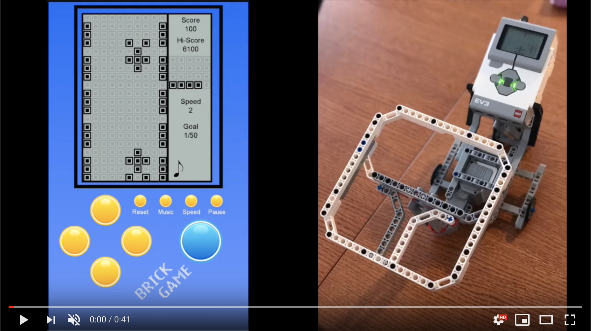

# CarRacingLegoMindstormsPython

> Video available here https://youtu.be/cMtEcG9jx_0

## Table of contents
* [General info](#general-info)
* [Screenshots](#screenshots)
* [Technologies](#technologies)
* [Contact](#contact)

## General info
Car racing game using python on EV3 Brick . Documentation https://education.lego.com/en-us/support/mindstorms-ev3/python-for-ev3

## Screenshots

## Technologies
- Python
- Visual studio Code

## Contact
Created by lukasz.neumann90@gmail.com - feel free to contact me!
